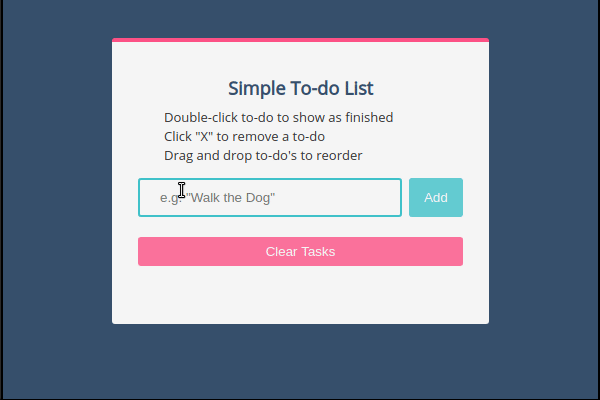

# Simple To-do List

## Showcase

## Technology Used

- HTML & CSS
- JavaScript with jQuery

## Features

- The user can add a new item to a list of tasks.
- The user can cross out an item from the list of tasks.
- The user can delete an item from the list of tasks.
- The user can change the order of items in the list of tasks.
- The user can remove all tasks at once.
